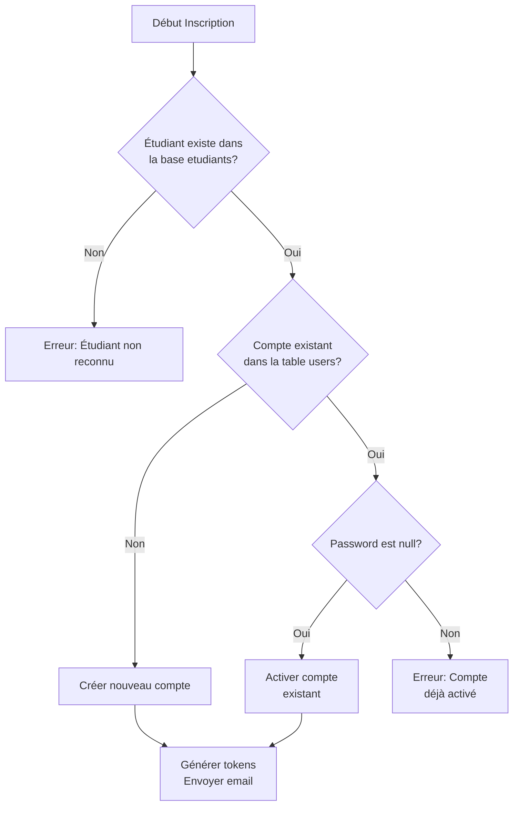
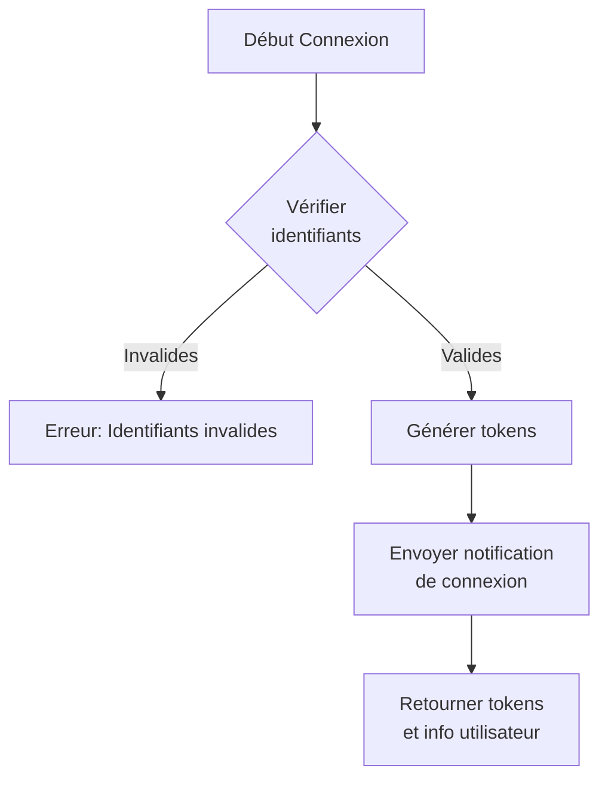
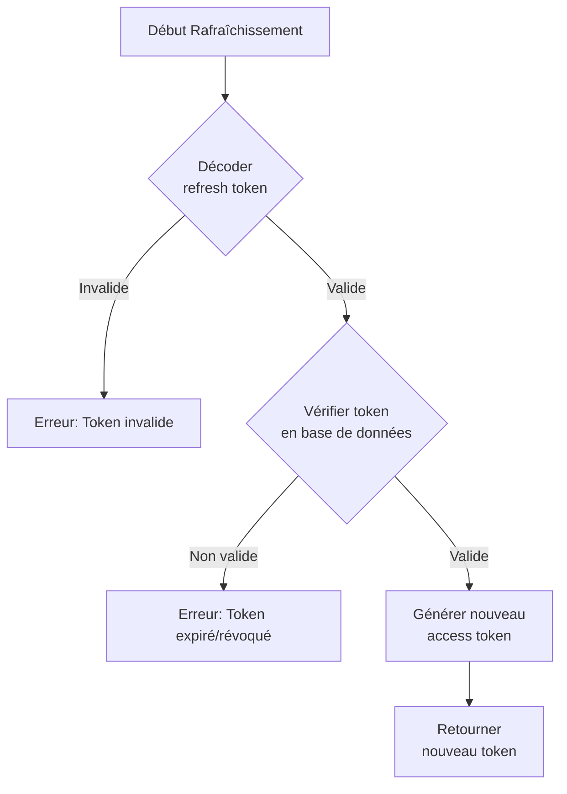
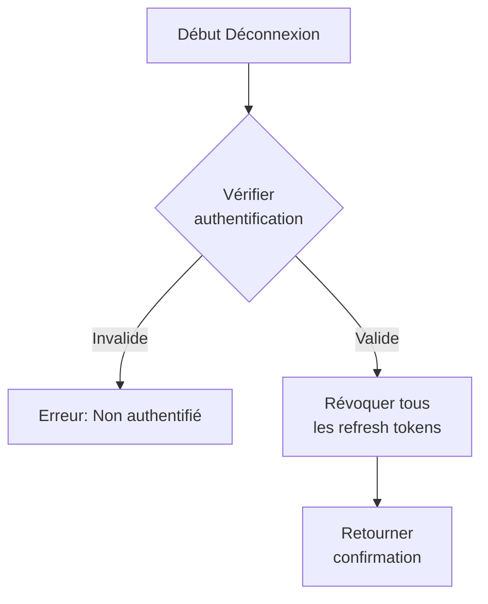

# Documentation d'Authentification COUD

## Introduction

Ce document détaille le système d'authentification utilisé dans l'application COUD. Il est conçu pour les développeurs qui souhaitent comprendre comment l'authentification est implémentée et comment l'utiliser dans leurs propres développements.

## Concepts Clés

Notre système d'authentification repose sur plusieurs concepts fondamentaux :

### JWT (JSON Web Token)

Les JSON Web Tokens sont utilisés pour l'authentification et l'autorisation. Ils permettent de :
- Transmettre de l'information de manière sécurisée
- Vérifier l'identité de l'utilisateur
- Limiter l'accès aux ressources protégées

Notre système utilise deux types de tokens :
1. **Access Token** : Durée de vie courte (1 heure), utilisé pour authentifier les requêtes API
2. **Refresh Token** : Durée de vie longue (30 jours), utilisé pour générer de nouveaux access tokens

### Gestion des Utilisateurs Pré-enregistrés

Notre application est conçue pour un système universitaire où les étudiants sont déjà pré-enregistrés dans la base de données `etudiants`. Le processus d'inscription consiste donc à :
1. Vérifier si l'étudiant existe dans la base de données `etudiants`
2. Créer ou activer un compte utilisateur dans la table `users`

## Architecture du Code

### Fichiers Principaux

Le système d'authentification s'appuie sur les fichiers suivants :

- **Controllers**
  - `app/api/Controllers/AuthController.php` : Gère les requêtes HTTP d'authentification

- **Services**
  - `app/api/Services/AuthService.php` : Contient la logique métier d'authentification

- **Models**
  - `app/api/Models/User.php` : Gère les interactions avec la base de données pour les utilisateurs

- **Middlewares**
  - `app/api/Middlewares/JWTAuthMiddleware.php` : Valide les tokens JWT pour les routes protégées

- **Librairies**
  - `app/Lib/JWT.php` : Gère la génération et la validation des tokens
  - `app/Lib/EmailService.php` : Gère l'envoi d'emails de notification

## Guide Pas à Pas

### 1. Inscription d'un Utilisateur

Le processus d'inscription est particulier car il doit traiter plusieurs cas :



#### Code d'implémentation

Pour implémenter cette logique, le développeur doit :

1. **Vérifier si l'étudiant existe :**
```php
$exists = User::checkIfStudentExists(
    $userData['matricule'],
    $userData['nom'],
    $userData['prenom'],
    $userData['date_naissance']
);
```

2. **Vérifier si un compte utilisateur existe :**
```php
$existingUser = User::findByMatricule($userData['matricule']);
```

3. **Gérer les différents cas :**
```php
if ($existingUser) {
    if (empty($existingUser['password'])) {
        // Activation de compte
    } else {
        // Erreur: compte déjà activé
    }
} else {
    // Création de nouveau compte
}
```

### 2. Connexion Utilisateur

Le processus de connexion est plus simple :



#### Code d'implémentation

1. **Vérifier les identifiants :**
```php
$user = User::verifyCredentials($matricule, $password);
```

2. **Générer les tokens :**
```php
$accessToken = JWT::generate($user);
$refreshToken = JWT::generateRefreshToken($user);
```

3. **Envoyer une notification :**
```php
$this->emailService->sendLoginNotification($user);
```

### 3. Rafraîchissement des Tokens

Lorsque l'access token expire, l'application peut demander un nouveau token en utilisant le refresh token :



#### Code d'implémentation

1. **Décoder le token :**
```php
$decoded = JWT::decode($refreshToken);
```

2. **Vérifier la validité en base de données :**
```php
$isValid = User::verifyRefreshToken($userId, $refreshToken);
```

3. **Générer un nouveau access token :**
```php
$accessToken = JWT::generate($user);
```

### 4. Déconnexion

La déconnexion consiste à révoquer tous les refresh tokens de l'utilisateur :



#### Code d'implémentation

1. **Vérifier l'authentification :**
```php
$token = JWT::extractTokenFromHeader();
$decoded = JWT::decode($token);
```

2. **Révoquer les tokens :**
```php
User::invalidateAllRefreshTokens($decoded->data->id);
```

## Structure de la Base de Données

Le système d'authentification utilise deux tables principales :

### Table `users`

```sql
CREATE TABLE users (
  id INT AUTO_INCREMENT PRIMARY KEY,
  matricule VARCHAR(20) NOT NULL UNIQUE,
  nom VARCHAR(100) NOT NULL,
  prenom VARCHAR(100) NOT NULL,
  date_naissance DATE NOT NULL,
  email VARCHAR(255) NOT NULL,
  password VARCHAR(255),
  role VARCHAR(20) DEFAULT 'etudiant',
  created_at TIMESTAMP DEFAULT CURRENT_TIMESTAMP,
  updated_at TIMESTAMP NULL
);
```

### Table `refresh_tokens`

```sql
CREATE TABLE refresh_tokens (
  id INT AUTO_INCREMENT PRIMARY KEY,
  user_id INT NOT NULL,
  token VARCHAR(255) NOT NULL,
  revoked BOOLEAN DEFAULT 0,
  expires_at TIMESTAMP NOT NULL,
  created_at TIMESTAMP DEFAULT CURRENT_TIMESTAMP,
  FOREIGN KEY (user_id) REFERENCES users(id) ON DELETE CASCADE
);
```

## Guide d'Implémentation Frontend

Pour intégrer ce système d'authentification dans une application frontend, suivez ces conseils :

### 1. Stockage des Tokens

```javascript
// Après la connexion
function handleLogin(response) {
  // Stocker l'access token en mémoire
  sessionStorage.setItem('accessToken', response.accessToken);
  
  // Stocker le refresh token dans un cookie HttpOnly (via le backend)
  // ou dans le localStorage si nécessaire
  localStorage.setItem('refreshToken', response.refreshToken);
}
```

### 2. Intercepteur pour les Requêtes Authentifiées

```javascript
// Exemple avec Axios
axios.interceptors.request.use(config => {
  const token = sessionStorage.getItem('accessToken');
  if (token) {
    config.headers.Authorization = `Bearer ${token}`;
  }
  return config;
});
```

### 3. Gestion du Rafraîchissement de Token

```javascript
// Intercepteur pour gérer les erreurs 401
axios.interceptors.response.use(
  response => response,
  async error => {
    const originalRequest = error.config;
    
    if (error.response.status === 401 && !originalRequest._retry) {
      originalRequest._retry = true;
      
      try {
        // Demander un nouveau token
        const refreshToken = localStorage.getItem('refreshToken');
        const response = await axios.post('/api/auth/refresh-token', { refreshToken });
        
        // Mettre à jour le token
        const newToken = response.data.accessToken;
        sessionStorage.setItem('accessToken', newToken);
        
        // Réessayer la requête originale
        axios.defaults.headers.common['Authorization'] = `Bearer ${newToken}`;
        return axios(originalRequest);
      } catch (error) {
        // Rediriger vers la page de connexion
        logout();
        window.location.href = '/login';
        return Promise.reject(error);
      }
    }
    
    return Promise.reject(error);
  }
);
```

## Cas d'Utilisation Avancés

### Authentification avec Différents Rôles

Notre système prend en charge différents rôles utilisateur (`etudiant`, `admin`, etc.). Pour restreindre l'accès en fonction des rôles :

```php
// Dans le fichier de routes
$router->get('/admin/dashboard', [AdminController::class, 'dashboard'], 
    new JWTAuthMiddleware(['admin']));
```

### Vérification d'Email

Si vous souhaitez ajouter une vérification d'email avant d'activer un compte :

1. Ajoutez un champ `email_verified` à la table `users`
2. Modifiez le processus d'inscription pour générer un token de vérification
3. Envoyez un email avec un lien contenant ce token
4. Créez un endpoint pour vérifier ce token et activer le compte

## Résolution des Problèmes Courants

### 1. Erreur "Token invalide"

**Cause possible :** L'access token a expiré ou est mal formé.
**Solution :** Vérifiez la validité du token et utilisez le refresh token pour en obtenir un nouveau.

### 2. Erreur "Refresh token invalide"

**Cause possible :** Le refresh token a expiré, a été révoqué, ou est mal formé.
**Solution :** Demandez à l'utilisateur de se reconnecter.

### 3. Utilisateur Non Trouvé dans la Base `etudiants`

**Cause possible :** Les informations fournies ne correspondent pas à un étudiant existant.
**Solution :** Vérifiez que les informations (matricule, nom, prénom, date de naissance) sont correctes et correspondent exactement aux données dans la base.

## Conclusion

Ce système d'authentification est conçu pour répondre aux besoins spécifiques d'une application universitaire. Il permet de gérer efficacement les comptes utilisateurs tout en maintenant un niveau de sécurité élevé grâce à l'utilisation des JWT et des refresh tokens.

Pour toute question ou suggestion d'amélioration, veuillez contacter l'équipe de développement.
