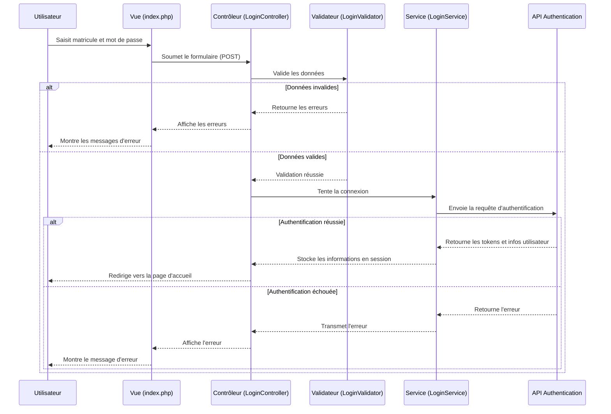

# Documentation de l'Interface de Connexion

## Introduction

L'interface de connexion permet aux utilisateurs de s'authentifier dans l'application COUD en utilisant leur matricule et mot de passe. Elle est conçue de manière à être réactive, sécurisée et facile à utiliser tout en respectant les standards modernes de développement web.

## Architecture MVC

L'interface de connexion suit le modèle MVC (Modèle-Vue-Contrôleur) :

### Modèle
- `app/Models/User.php` - Gère les interactions avec la base de données pour les utilisateurs.

### Vue
- `app/Views/login/index.php` - Interface utilisateur du formulaire de connexion utilisant Bootstrap.

### Contrôleur
- `app/Controllers/LoginController.php` - Traite les requêtes HTTP liées à la connexion.

### Composants Supplémentaires
- `app/Services/LoginService.php` - Service qui gère la logique métier de l'authentification via l'API.
- `app/Validations/LoginValidator.php` - Valide les données du formulaire de connexion.
- `app/logs/ErrorHandler.php` - Gère et journalise les erreurs survenues pendant le processus de connexion.

## Flux de Connexion

Le processus de connexion suit ce flux :

## Intégration avec l'API

L'interface de connexion communique avec l'API d'authentification en suivant ces étapes :

1. Le `LoginService` prépare les données à envoyer à l'API
2. Une requête POST est envoyée à l'endpoint `/api/auth/login`
3. L'API vérifie les identifiants et retourne une réponse
4. Le service traite la réponse :
   - En cas de succès : stocke les tokens et informations utilisateur en session
   - En cas d'échec : retourne l'erreur pour affichage

## Interface Utilisateur

L'interface utilisateur a été conçue avec Bootstrap 5 pour garantir un design moderne et réactif :

- Formulaire de connexion dans une carte avec ombre
- Validation côté client et côté serveur
- Affichage des erreurs sous chaque champ concerné
- Option "Se souvenir de moi" pour les connexions persistantes
- Bouton pour afficher/masquer le mot de passe
- Liens vers la récupération de mot de passe et la création de compte

## Sécurité

Plusieurs mesures de sécurité ont été mises en place :

1. **Validation des données** : Toutes les entrées utilisateur sont validées côté serveur
2. **Protection contre les injections SQL** : Utilisation de requêtes préparées via PDO
3. **Tokens JWT** : Authentification via tokens stockés de manière sécurisée
4. **Logging des erreurs** : Journalisation des tentatives échouées pour analyse
5. **HTTPS** : L'application doit être servie via HTTPS en production
6. **Protection CSRF** : À implémenter dans une future mise à jour

## Personnalisation

Pour personnaliser l'interface de connexion, vous pouvez :

1. Modifier les styles CSS dans la section `<style>` du fichier `index.php`
2. Ajuster les messages d'erreur dans le validateur
3. Changer les icônes en modifiant les classes Font Awesome
4. Ajouter des champs supplémentaires selon vos besoins

## Dépendances

- **Bootstrap 5** : Framework CSS pour le design responsive
- **Font Awesome** : Bibliothèque d'icônes 
- **JavaScript** : Pour les interactions (affichage/masquage du mot de passe)

## Déploiement

Pour déployer l'interface de connexion :

1. Assurez-vous que l'API d'authentification fonctionne correctement
2. Vérifiez que les routes sont correctement configurées
3. Testez le formulaire de connexion avec des identifiants valides et invalides
4. Vérifiez la journalisation des erreurs

## Bonnes Pratiques

- Utilisez toujours des mots de passe forts
- Limitez le nombre de tentatives de connexion (implémenté dans l'API)
- Stockez les tokens de manière sécurisée
- Ne persistez jamais les mots de passe en clair
- Utilisez HTTPS en production
- Effectuez des tests réguliers de sécurité
